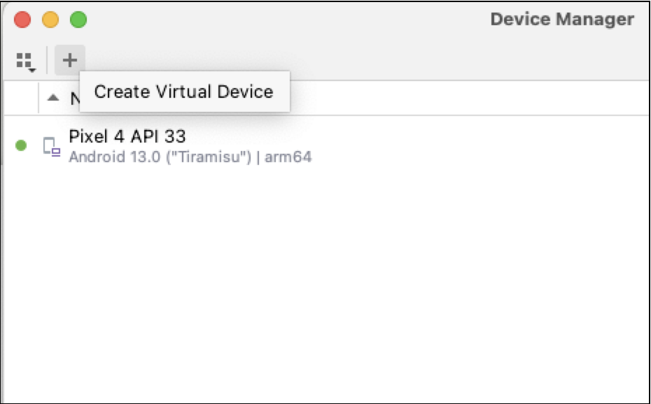

# Android studio introduction

### Peer instruction

### Installing a virtual device

**Tiramisu > Next** 

**Default configuration > Finish**

### Exercises:

**A)**

Make an output like this: 

Using:

- Text composable function.
- Column composable function
- Modifier.Background modifier

**B)**

- Make a new activity
- Make the new activity the launch activity

- Make the new activity the launch activity

- Make an application like this using composables:

**B)**

- Make a new activity
- Make the new activity the launch activity

**C)**

- Make a new activity

- Make your own digital business card layout such as this: 

