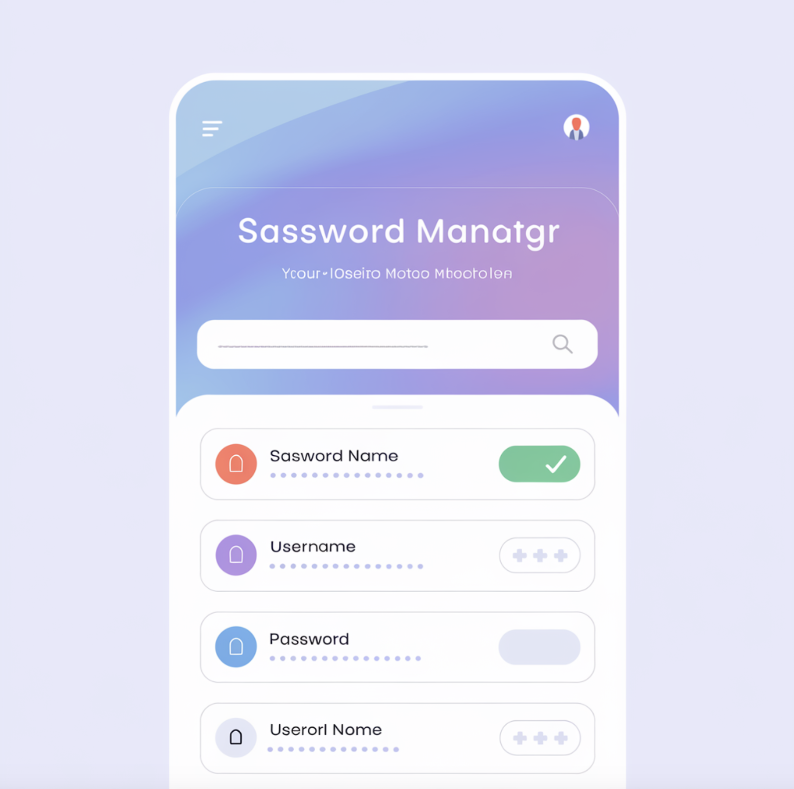

# UI - Lists


## Overview

- Struktur
- Snakke om eksamen. Snakke om IT-arkitektur.
- Create a idea generator app
  - `logd`
  - Mind mig om at uploade kode jeg skriver i klassen, jeg er dårlig til at huske det!
- Work on app for today
- Break at 10:00
- 11:30 presenation of my solution


<!--

Show the primary color theme! https://m3.material.io/theme-builder#/custom


## After class considerations

- This could be made into creating a password manager and then talking about the benefits of such a password manager

-->


## Preparation

- [Add a scrollable list](https://developer.android.com/codelabs/basic-android-kotlin-compose-training-add-scrollable-list?continue=https%3A%2F%2Fdeveloper.android.com%2Fcourses%2Fpathways%2Fandroid-basics-compose-unit-3-pathway-2%23codelab-https%3A%2F%2Fdeveloper.android.com%2Fcodelabs%2Fbasic-android-kotlin-compose-training-add-scrollable-list#1)


## Learning goals

- Recap of state
- Lists `LazyColumn` vs `Column`
- `MutableStateListOf`


## `LazyColumn`

We can just use a column, but no recycler behavior (only rendering items on screen)


```kotlin
LazyColumn (
    modifier = Modifier
        .height(height = 70.dp)
){
    items(10) { i ->
        androidx.compose.material3.Icon(
            imageVector = Icons.Default.Settings,
            contentDescription = null
        )
    }
}
```


Iterate a list

```kotlin
@Composable
fun renderUsers(users: List<String>) {
    LazyColumn() {
        items(users) { name ->
            Text(text = name)
        }
    }
}
```


### MutableStateListOf

In Jetpack Compose, `mutableStateOf` is designed to trigger  recompositions when the state object itself changes (i.e., when a new object is assigned to it). However, mutating the contents of an object  (like adding an item to a `MutableList`) does not count as a state change in this context.

To make a list that works with Compose's reactive system, use `mutableStateListOf` instead. This function is observable and will trigger recompositions when items are added, removed, or updated


```kotlin
var ideas: MutableList<String> by remember {
    mutableStateOf(mutableStateListOf())
}
```


<!--

## Multiple activities


### 1. Create `SecondActivity` Kotlin File

First, you need to create a new Kotlin file for your second activity:

1. In Android Studio, right-click on the `app/src/main/java/your/package/name/` directory in the Project panel.
2. Choose `New` > `Kotlin File/Class`.
3. Name the new class, e.g., `SecondActivity`, and select `File` from the kind options.


Inside the new SecondActivity write

```kotlin
package YOUR_PACKAGE_HERE

import android.os.Bundle
import androidx.activity.ComponentActivity
import androidx.activity.compose.setContent
import androidx.compose.material3.Text

class SecondActivity : ComponentActivity() {
    override fun onCreate(savedInstanceState: Bundle?) {
        super.onCreate(savedInstanceState)
        setContent {
            Text(text = "lol")
        }
    }
}
```

`YOUR_PACKAGE_HERE` could fx be `com.example.basiclayoutexercisesolutions`


### 2. Add the activity to the `manifests/AndroidManifest.xml` file

After the main activity add the following:

```xml
<activity android:name=".SecondActivity" />
```


### 3. Navigate to the activity

In your `MainActivity.kt`

Add the following code:

```kotlin
Button(onClick = {
    val intent = Intent(this@MainActivity, SecondActivity::class.java);
    startActivity(intent);
}) {
    Text(text = "navigate to other Activity")
}
```

This code adds a button that when clicked navigates to the new activity

-->


## Password manager

I skal lave en password manager

Det her er bare et eksempel. Lav gerne appen som i selv vil. Lavet via Ideogram




Ligesom sidste uge, kan i enten kaste jer ud i det eller bruge den stilladserede guide. Her er kravene til opgaven

- Man skal kunne tilføje passwords til sin app. Et password skal have en titel og password. 
- Kan skal kunne slette dem igen
- Der skal være noget tekst der viser hvor mange passwords man har
- Man skal kunne kopiere sit password til clipholder
- Man skal kunne søge i sin liste - level 3
- Man skal kunne rykke rundt på sin liste - level 3


### 1 - UI

Først lave en sketch til jeres UI. Bagefter implementer UI'et i appen


### 2 - State

Lav en liste der indeholder passwords som Compose UI kan lytte til ændringer på

Tilføj nogle passwords til listen


### 3 - Rendering af varerne

Gør sådan at du kan se listen du lavede ovenover bliver renderet, så passwordsene kan ses på UI'et. Tænk her i `LazyColumn`. 

Du burde nu kunne se de varer du tilføjede i `2 - State` i UI'et


### 4 - Status tekst

Lav en status tekst oppe i toppen der viser hvor mange passwords der er i listen


### 5 - Tilføjelse af nye passwords

Lav et element der kan tage imod bruger input til titel og password og en knap. Når der bliver klikket på knappen skal det der står i input feltet tilføjes til listen du lavede i `2 - State`. 

Du burde nu have en virkende password manager app 🎉 Det kalder vi en MVP - Minimal Viable Product. Det mindte antal features vi kan lave for at appen stadig virker


### 6 - Sletning af passwords

Gør sådan at for hver vare, renderer du også en slet knap. Når det bliver klikket på slet knappen skal den vare slettes fra listen


### 7 - Componentiser dit UI

Lav komponenter (`@Composable`) for hvert komponent i dit interface. Husk at vi gerne vil holde komponenter stateless. 


### 8 - Resten af features

Nu er du så langt at du kan prøve at kaste dig ud i de resterende features uden hjælp herfra


