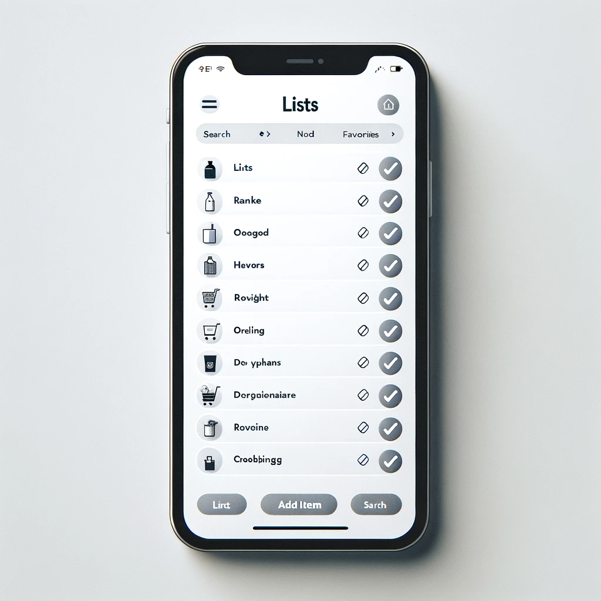

# UI - Lists


## Overview

- Struktur
- Create a idea generator app
  - Show the primary color theme! [https://m3.material.io/theme-builder#/custom](https://m3.material.io/theme-builder#/custom)
  - logd
  - Mind mig om at uploade kode jeg skriver i klassen, jeg er dårlig til at huske det!
- Work on app for today
- Break at 10:00
- 11:30 presenation of my solution


<!--

## After class considerations

- This could be made into creating a password manager and then talking about the benefits of such a password manager

-->


## Preparation

- [Add a scrollable list](https://developer.android.com/codelabs/basic-android-kotlin-compose-training-add-scrollable-list?continue=https%3A%2F%2Fdeveloper.android.com%2Fcourses%2Fpathways%2Fandroid-basics-compose-unit-3-pathway-2%23codelab-https%3A%2F%2Fdeveloper.android.com%2Fcodelabs%2Fbasic-android-kotlin-compose-training-add-scrollable-list#1)


## Learning goals

- Recap of state
- Lists `LazyColumn` vs `Column`
- `MutableStateListOf`


## `LazyColumn`

We can just use a column, but no recycler behavior (only rendering items on screen)


```kotlin
LazyColumn (
    modifier = Modifier
        .height(height = 70.dp)
){
    items(10) { i ->
        androidx.compose.material3.Icon(
            imageVector = Icons.Default.Settings,
            contentDescription = null
        )
    }
}
```


Iterate a list

```kotlin
@Composable
fun renderUsers(users: List<String>) {
    LazyColumn() {
        items(users) { name ->
            Text(text = name)
        }
    }
}
```


### MutableStateListOf

In Jetpack Compose, `mutableStateOf` is designed to trigger  recompositions when the state object itself changes (i.e., when a new object is assigned to it). However, mutating the contents of an object  (like adding an item to a `MutableList`) does not count as a state change in this context.

To make a list that works with Compose's reactive system, use `mutableStateListOf` instead. This function is observable and will trigger recompositions when items are added, removed, or updated


<!--

## Multiple activities


### 1. Create `SecondActivity` Kotlin File

First, you need to create a new Kotlin file for your second activity:

1. In Android Studio, right-click on the `app/src/main/java/your/package/name/` directory in the Project panel.
2. Choose `New` > `Kotlin File/Class`.
3. Name the new class, e.g., `SecondActivity`, and select `File` from the kind options.


Inside the new SecondActivity write

```kotlin
package YOUR_PACKAGE_HERE

import android.os.Bundle
import androidx.activity.ComponentActivity
import androidx.activity.compose.setContent
import androidx.compose.material3.Text

class SecondActivity : ComponentActivity() {
    override fun onCreate(savedInstanceState: Bundle?) {
        super.onCreate(savedInstanceState)
        setContent {
            Text(text = "lol")
        }
    }
}
```

`YOUR_PACKAGE_HERE` could fx be `com.example.basiclayoutexercisesolutions`


### 2. Add the activity to the `manifests/AndroidManifest.xml` file

After the main activity add the following:

```xml
<activity android:name=".SecondActivity" />
```


### 3. Navigate to the activity

In your `MainActivity.kt`

Add the following code:

```kotlin
Button(onClick = {
    val intent = Intent(this@MainActivity, SecondActivity::class.java);
    startActivity(intent);
}) {
    Text(text = "navigate to other Activity")
}
```

This code adds a button that when clicked navigates to the new activity

-->


## Indkøbsseddel

I skal lave en indkøbsseddel app hvor man kan skrive ind hvad man skal handle

Det her er bare et eksempel. Lav gerne appen som i selv vil. Lavet via Dalle 3




Ligesom sidste uge, kan i enten kaste jer ud i det eller bruge den stilladserede guide. Her er kravene til opgaven

- Man skal kunne tilføje varer til sin indkøbsseddel
- Kan skal kunne slette dem igen
- Der skal være noget tekst der viser hvor mange elementer man har i indkøbsseddlen
- Man skal kunne tilføje antal for en vare (fx 5 mælk) - level 2
- Man skal kunne strege en vare ud (ikke slette den) - level 3
- Man skal kunne rykke rundt på sin liste - level 3
- Når en vare er krydset ud skal den ryge ned i bunden af listen - level 3


### 1 - UI

Først lave en sketch til jeres UI. Bagefter implementer UI'et i appen


### 2 - State

Til at begynde med har vi kun en form for state vi holder øje med nemlig listen af varer. Derfor lav en liste der indeholder varer som Compose UI kan lytte på ændringer på

Tilføj et par varer til listen


### 3 - Rendering af varerne

Gør sådan at du kan se listen du lavede ovenover bliver renderet, så varerne kan ses på UI'et. Tænk her i `LazyColumn`. 

Du burde nu kunne se de varer du tilføjede i `2 - State` i UI'et


### 4 - Status tekst

Lav en status tekst oppe i toppen der viser hvor mange elementer der er i listen


### 5 - Tilføjelse af nye varer

Lav et element der kan tage imod bruger input og en knap. Når der bliver klikket på knappen skal det der står i input feltet tilføjes til listen du lavede i `2 - State`. 

Du burde nu have en virkende indkøbsseddel app 🎉 Det kalder vi en MVP - Minimal Viable Product. Det mindte antal features vi kan lave for at appen stadig virker


### 6 - Sletning af varer

Gør sådan at for hver vare, renderer du også en slet knap. Når det blvier klikket på slet knappen skal den vare slettes fra listen


### 7 - Conponentiser dit UI

Lav componenter (`@Composable`) for hvert komponent i dit interface. Husk at vi gerne vil holde komponenter stateless. Skal skal gøre vis state hoisting!


### 7 - Vare antal

Det skal nu være muligt for en bruger at indtaste antal på en vare. Hvis du indtil nu har gemt en vare som en streng, så det ved at være på tide at tænke i klasser i stedet for


### 8 - Resten af features

Nu er du så langt at du kan prøve at kaste dig ud i de resterende features uden hjælp herfra


