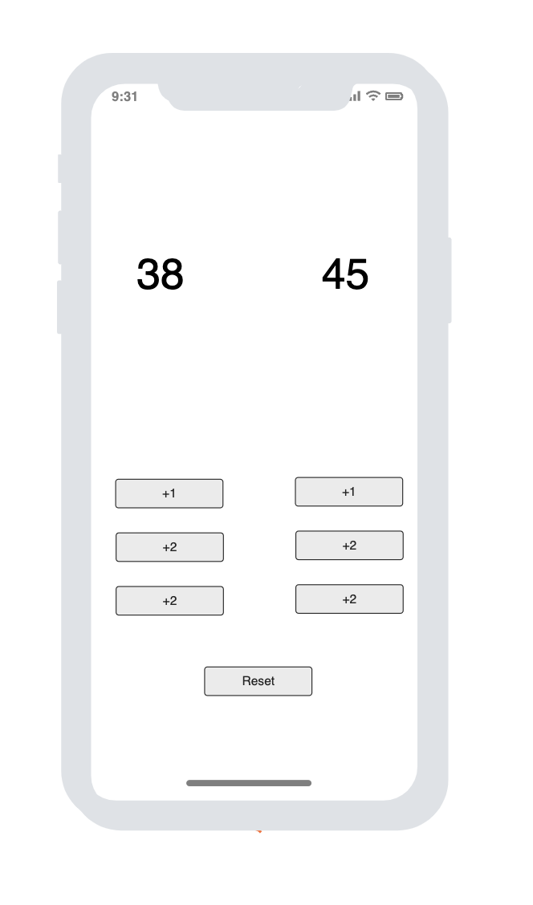
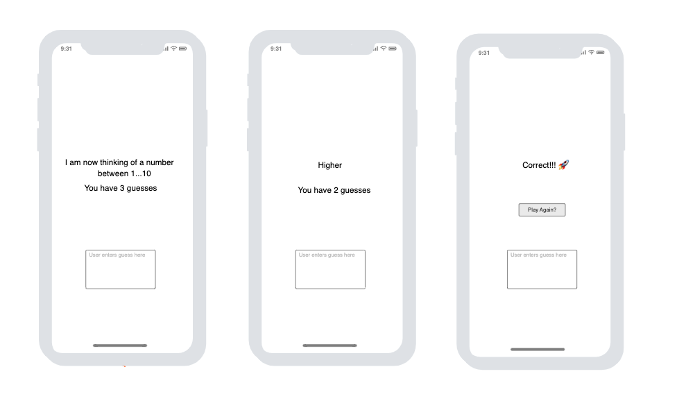

# Architecture components & MVVM

Add the following to your projects gradle file dependency: 

```kotlin
implementation("androidx.lifecycle:lifecycle-viewmodel-compose:2.7.0")
```


#### In these exercises styling is <u>not</u> the most imporant part. You should <u>not</u> prioritize styling 


**Court-counter**

You will be building on an already existing codebase: https://github.com/nicklasdean/court_counter_text_mirror

Your task is to build a simple but useful tool for judges in of a basketball match



**Higher or lower**

- Create a new application
- Your task is to implement the simple game **higher or lower**
  - The user has 3 guesses to guess the number generated by the computer
  - The computer has to help the user and tell if the number is higher or lower than the last guess
  - All game state should be controlled by a ViewModel class


```kotlin
//This could be the start of the viewmodel

class GameViewModel : ViewModel() {
    var secretNumber = generateRandomNumber();
    var numberOfGuessesLeft: Int by mutableIntStateOf(3)
    var userInput: String by mutableStateOf("");
    var messageToUser: String by mutableStateOf("");
}
```



If you are stuck - you can get inspired from: https://github.com/nicklasdean/GuessMyNumber


**Advanced (Optional)**

- Instead of guessing a single number, the computer generates a list of numbers between 1-10.
- The user guesses one number at a time and at the end gets displayed how many was guessed correctly