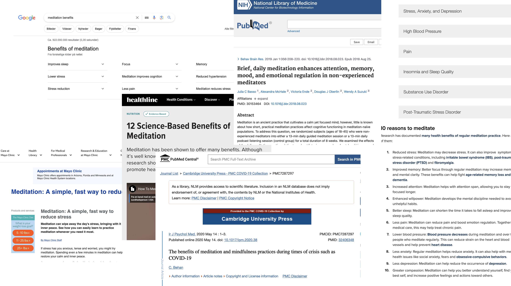
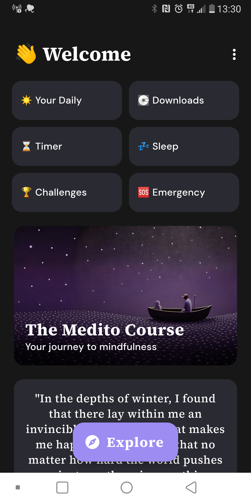
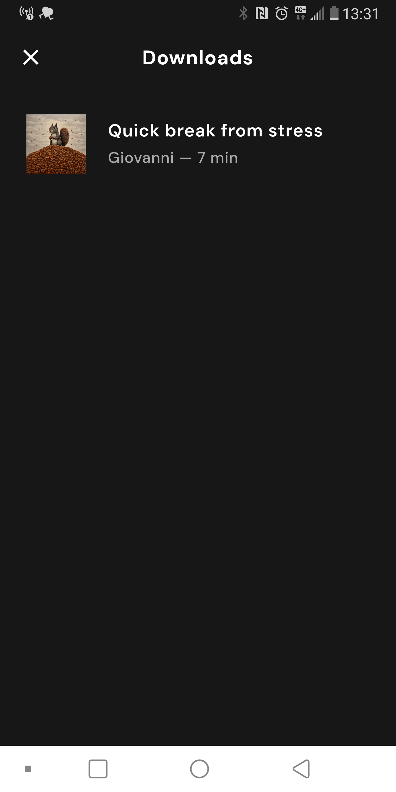
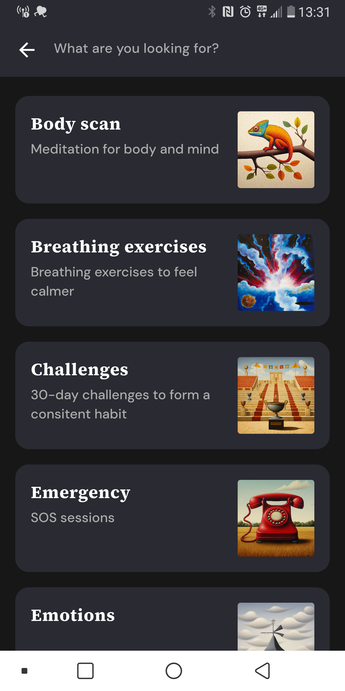
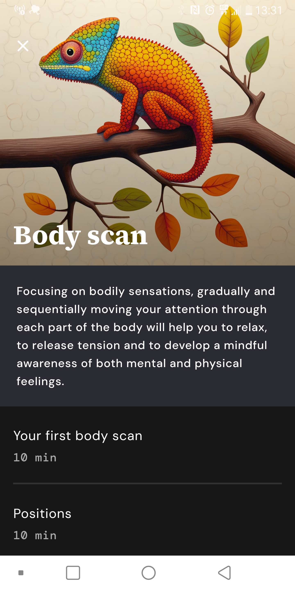
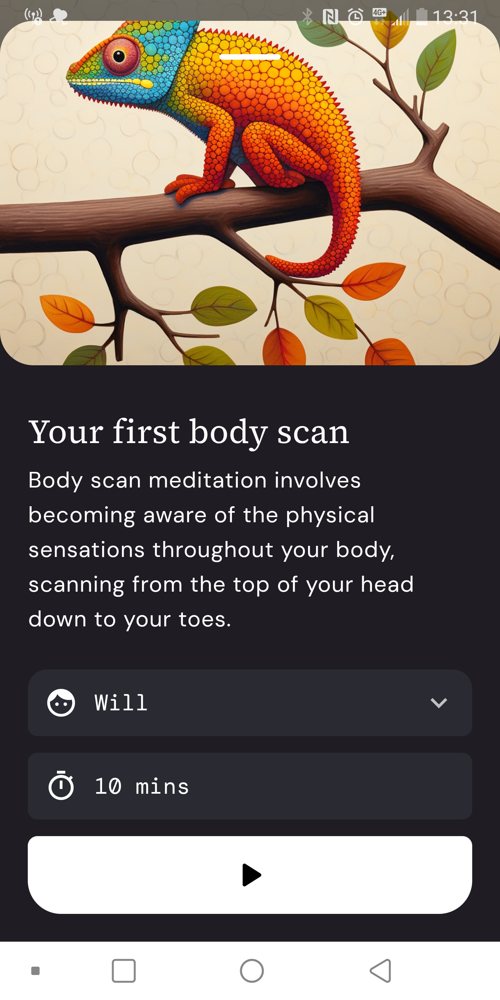
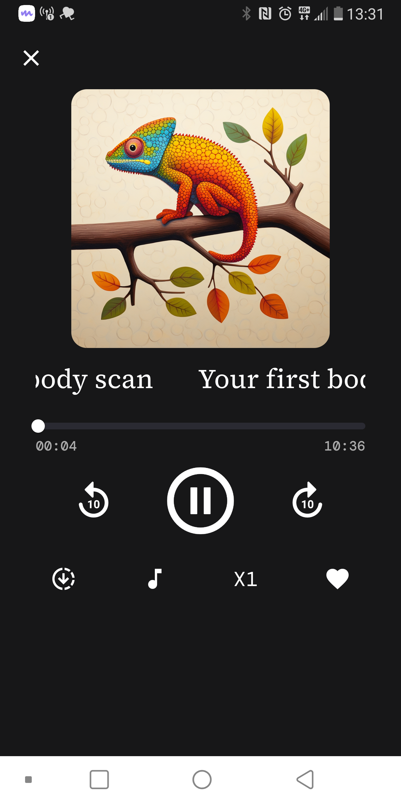

# Navigation


<!--

## After class considerations

- Den var lidt for svær idag. Præsentationen var ikke specielt lærerig for dem
- Jeg skulle have startet med at lave et lille eksempel. Måske er jeg ved at vænne dem til at jeg forklarer alt?
- Kodeeksemplet var også alt for kompliceret
- Ellers meditation gik godt
- Forberedelse var ikke super godt

-->


## Overview

- Should video title be `val` or `var` [https://www.youtube.com/watch?v=d0d9nsTLaKo](https://www.youtube.com/watch?v=d0d9nsTLaKo)
- Husk aflevering søndag!
- Create presentation
- Small guided meditation through Medito
  - Quick intro to benefits from meditating
  - [https://meditofoundation.org/meditations/beginner-meditation-course](https://meditofoundation.org/meditations/beginner-meditation-course)
- Work on case. Recreate the navigation of the Medito App





## Learning goals

- Compose navigation
- `Navhost`
- `NavController`
- Backstack


## Preparation

- [Navigation Basics in Jetpack Compose](https://youtu.be/glyqjzkc4fk?si=KSPDW3sO_3WTSY3D)

- [Send Arguments between Screens | Navigation in Jetpack Compose (the first 10 min are most important)](https://youtu.be/doGsRC2J1Fc?si=Ccq9Op22ElPBA9EZ)
- [Nested Navigation | Jetpack Compose](https://youtu.be/2sKnGloDJf0?si=snKVgK22jYYLKVNg)


- [https://developer.android.com/jetpack/compose/navigation](https://developer.android.com/jetpack/compose/navigation) - optional

- [Jetpack Compose Navigation: The Complete Beginner's Course](https://youtu.be/jt5sJEnDsSQ?si=HLF3qV0BaRB8MhuZ) - optional


## `Navhost`

An empty container that displays the composables that are navigated to. Kind of like `index.html`shows different routes in react.

A NavHost is a Composable that displays other composable destinations, based on a given route. 

As you navigate between composables, the content of the `NavHost` is automatically [recomposed](https://developer.android.com/jetpack/compose/mental-model#recomposition).


## `NavController`

An object that manages app navigation within a `NavHost`. The `NavController` orchestrates the swapping of destination content in the `NavHost` as users move throughout your app.


### Arguments

Sending arguments to another route is a bit tricky. Here is how it works:


### First setup the route

First we need to tell Compose that the route can take an argument, we do that in the route by adding the `sendArgumentsHere/{name}`. This is very much like in NodeJS/Express. We now need to tell Compose navigation that the route `sendArgumentsHere` can take some arguments. We do that with the `arguments = listOf(navArgument("name") { type = NavType.StringType })`. Here we tell Compose navigation that it can take one parameter that has a String as a type. 

Now to get the actual argument we write this:

```kotlin
val name = backStackEntry.arguments?.getString("name") ?: return@composable
SendArgumentsHere(name)
```

The first line gets the name argument from the backStack if the name argument is passed. Then we call the `SendArgumentsHere` Composable function with that argument


### Add the argument to the Composable

The Composable function need to take the name argument

```kotlin
@Composable
fun SendArgumentsHere(name: String) {
    Text(text = name)
}
```


### Navigate to the route with a specific name

This is the easy part:

```kotlin
navController.navigate("sendArgumentsHere/Benjamin");
```

Here we send the string `"Benjamin"` to the `SendArgumentsHere` composable function


### BackStack

[https://developer.android.com/guide/navigation/backstack](https://developer.android.com/guide/navigation/backstack)

The back stack consists of a stack of navigation screens. Every time you navigate to a new screen, the with fx `navController.navigate("screen1")` the stack new screen is added to the back stack. When the back button is pressed, the latest screen on the backstack is removed (or [poped](https://www.youtube.com/watch?v=o724TbnN4Mk) to be more precise)


### `popBackStack`

We can pop the back stack ourselves by calling `navController.popBackStack()`. This will be like pressing the back button

We can also pop back to a specific route `navController.popBackStack("screen1", false)`. Everything above that route will pop. The second argument specifies if the route itself should also be poped. 


## Code example

```kotlin
package com.example.navigation

import android.os.Bundle
import androidx.activity.ComponentActivity
import androidx.activity.compose.setContent
import androidx.compose.foundation.layout.Column

import androidx.compose.foundation.layout.fillMaxSize
import androidx.compose.foundation.lazy.LazyColumn
import androidx.compose.foundation.lazy.items
import androidx.compose.material3.Button
import androidx.compose.material3.MaterialTheme
import androidx.compose.material3.Surface
import androidx.compose.material3.Text
import androidx.compose.runtime.Composable
import androidx.compose.runtime.getValue
import androidx.compose.runtime.mutableIntStateOf
import androidx.compose.runtime.mutableStateOf
import androidx.compose.runtime.remember
import androidx.compose.runtime.setValue
import androidx.compose.ui.Modifier

import androidx.compose.ui.tooling.preview.Preview
import androidx.compose.ui.unit.dp
import androidx.compose.ui.unit.sp
import androidx.navigation.NavController
import androidx.navigation.NavHostController
import androidx.navigation.NavType
import androidx.navigation.compose.NavHost
import androidx.navigation.compose.composable
import androidx.navigation.compose.rememberNavController
import androidx.navigation.navArgument
import com.example.navigation.ui.theme.NavigationTheme


class MainActivity : ComponentActivity() {
    override fun onCreate(savedInstanceState: Bundle?) {
        super.onCreate(savedInstanceState)

        setContent {
            val information by remember {
                mutableStateOf( mutableMapOf<String, Int>("price1" to 6));
            }

            val navController = rememberNavController()
            Column {
                Text(text = "asd")
                NavHost(navController = navController, startDestination = "screen1") {
                    composable("screen1") {
                        Screen1("benjamin",
                            onNavigate = {
                            information["price2"] = 2;
                            navController.navigate("screen2")
                            println(navController.currentBackStackEntry)
                        }, onToArguments = {
                            navController.navigate("sendArgumentsHere/Benjamin")
                        })
                    }
                    composable("screen2") {
                        Screen2(id = 2, onNavigate = {
                            information["price3"] = 5;
                            navController.navigate("screen3")
                            println(navController.currentBackStackEntry)
                        })
                    }
                    composable("screen3") {
                        Screen3(information, onBackToStart = {
                            navController.popBackStack("screen1", false);
                            println(navController.currentBackStackEntry)
                        })
                    }
                    composable("sendArgumentsHere/{name}", arguments = listOf(navArgument("name") { type = NavType.StringType })) { backStackEntry ->
                        val name = backStackEntry.arguments?.getString("name") ?: return@composable
                        SendArgumentsHere(name)
                    }
                }
            }
        }
    }
}

@Composable
fun Screen1(name: String, onNavigate: ()-> Unit, onToArguments: () -> Unit) {
    Column {
        Text(
            text = "Screen 1",
            fontSize = 32.sp
        )
        Text(
            text = "Hello $name!"
        )
        Button(onClick = onNavigate) {
            Text("Go to Screen 2")
        }
        Button(onClick = onToArguments) {
            Text("To arguments screen")
        }
    }
}

@Composable
fun Screen2( id: Int, onNavigate: () -> Unit) {
    Column {
        Text(
            text = "Screen 2!",
            fontSize = 32.sp
        )
        Button(onClick = onNavigate) {
            Text(text = "Go to screen 3")
        }
    }
}

@Composable
fun Screen3(status: MutableMap<String, Int>, onBackToStart: () -> Unit) {
    Column {
        Text(
            text = "Screen 3",
            fontSize = 32.sp
        )
        Text(
            text = "We are at ${status["price1"]}, ${status["price2"]}, , ${status["price3"]}!!!"
        )
        Button(onClick = onBackToStart) {
            Text(text = "Back to start");
        }
    }
}

@Composable
fun SendArgumentsHere(name: String) {
    Text(text = name)
}
```


## 📝 Navigations præsentation - 30 min

I din studiegruppe lav en præsentation på 5 min der kommer ind på disse emner:

- `NavHost` and `NavController`
- Navigation between routes
- Sending data from one route to another
- `popBackStack`


## 📝 Case - Recreate the Medito app

In this case you will recreate the navigation of the Medito App. Todays focus should be on the navigation part and not the design of the app. The design can be very crude and that is fine

For the case you can download the Medito app ([Link here](https://meditofoundation.org/medito-app)) or follow the screenshots below. 

Medito Foundation is a nonprofit dedicated to improving mental wellbeing and helping people cope better with depression, stress, anxiety, and  any other negative states of mind. They have created a free app that gives you tons of really good meditations to try out. 


### 1 - Dashboard - Level 1

First create a `Composable` that shows the dashboard. Dont focus on design, but more the content.




### 2 - Downloads - Level 2

From the Dashboard clicking on `Downloads` should take you to this view. Again dont spend too much time on design, but more on creating a `Donwloads` `Composable` that is activated when clicking on `Downloads`



### 3 - Explore - Level 2

Clicking on `Explore` Will take you to this view. There is a back button, a `TextField` and a list of `Meditations`

Make the back button work and make the items in the list clickable. 

You can simplify this by not using a `List` of meditations, but just have individual `Composable`'s on top of each other!



### 4 - Meditation group - Level 2/Level 3

Clicking on one of the Meditations from above will take you to one of these views. 

**Level 2** - Here you navigate to a `Composable`  fx. called `BodyScan`. You can then make individual composables for each item in the list above (or as many as see fit)

**Level 3** - Make a `Composable` that is more general that can receive the clicked item. Maybe you call it `MeditationOverview`. That composable needs a title, image, description and list of meditations. Now to send these attributes as an object is not best practice, neither is sending an image: [https://stackoverflow.com/questions/67121433/how-to-pass-object-in-navigation-in-jetpack-compose](https://stackoverflow.com/questions/67121433/how-to-pass-object-in-navigation-in-jetpack-compose) More official details [here](https://stackoverflow.com/a/69060224/2263329). 

So how can we fix this problem?

<!-- Therefore instead when you click on a topic above, you only send the id of the topic. Then you have another `List` or `Map` that keeps track of the topics list `List<Topics>` -->





### 5 - Finish the app navigation

Clicking a meditation will take you to the meditation composable.




Clicking play will take you to the player


