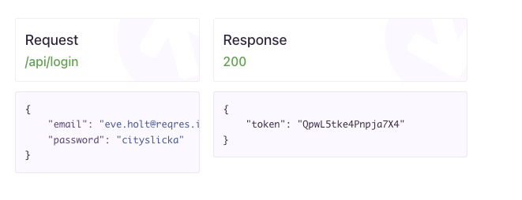
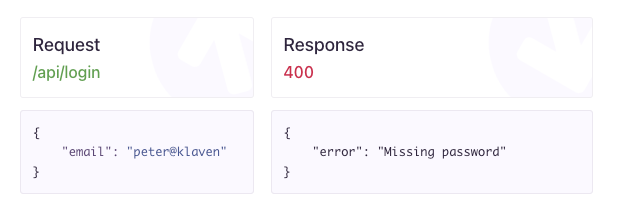

# Data from the internet - Retrofit


### Interface

An interface works a lot like a contract or a set of rules. In an interface we define attributes and functions a class should have to implement that specific interface. 

Lets get concrete:

This Interface defines what it is like to be a `Product`. That means that classes implementing this interface **has to have** 

- An attribute called `name` which is a `String`
- An attribute called `price` which is an `Int`
- An attribute called `name` which is an `Int`
- An function called `printProductDetails` 

```kotlin
interface Product {
    val name: String;
    val price: Int;
  	val id: Int;
    fun printProductDetails();
}
```

Here is how an `interface` gets implemented by a class

```kotlin
class Television: Product {
		override val name: String,
    override val price: Int,
    override val id: Int
) : Product {
    override fun printProductDetails() {
				println("${this.name} is an amazing television");
    }
}
```

Let's initialise a television

```kotlin
val samsungTelevision: Television = Television("Samsung TV", 8000, 123456789);
```

We use the `override` keyword because we are overwriting a property from the interface we are implementing

We can even add functionality inside of the interface:

```kotlin
interface Computer{
    val name: String;
    val price: Int;
    val location: Map<String, Double>;

    fun printLocation() {
        println("${this.name} is an amazing television");
    };
}
```

Now we dont need to override the `printLocation` method because it has been defined

A class can inherit from only one class but can implement mutiple interfaces


Reference project: https://github.com/nicklasdean/retrofit-basic


- Read the documentation to the following API: 
  - https://www.boredapi.com/documentation


## Opgaver


### Opgaver 1 - Training Ground


## Make it work: GET request

#### Exercise A

Without using the android framework (empty project - as seen in the reference project)

- Create an API interface, Model / DTO and retrofit instance such that: 
  - You can fetch a single random event and print its properties to the console


#### Exercise B

Parameters example: 

```kotlin
@GET("offices")
fun getOffices(@Query("uid") uid: String,
               @Query("lat") latitude: Double,
               @Query("lon") longitude: Double
): Call<List<Office>>
```

Without using the android framework (empty project - as seen in the reference project)

- Expand the project with another API call with parameters
- The program takes a number of participants as parameter and returns a random activity with a given numbner of participants
  - The user inputs the parameters by standard input: readLine()


#### Exercise C

Without using the android framework (empty project - as seen in the reference project)

- Expand the project with another API call with parameters
- The program takes a specified accessibility in an inclusively constrained range of price (min / max price)
  - The user inputs the parameters by standard input: readLine()


## Make it work: POST request

- Read the documentation to the following API POST CREATE request: https://reqres.in/

  - Login - Successful
  - Login - Unsuccessful





#### Exercise A

Without using the android framework (empty project - as seen in the reference project)

- Create an API interface, Model / DTO and retrofit instance such that:
  - You can POST an email and password and receive a response for <u>registration</u>
    - If successful: Print the response to the console
    - If unsuccessful: Print the response to the console

  

- Create an API interface, Model / DTO and retrofit instance such that:

  - You can POST an email and password and receive a response for <u>login</u>
    - If successful: Print the response to the console
    - If unsuccessful: Print the response to the console

Reference: https://github.com/nicklasdean/retrofit-basic/tree/main/app/src/main/java/com/example/reqresPOSTexample


## Make it right: Repository pattern

**Refactor** the code such that:

- Registration & Login are both contained in a repository class that exposes 2 functions:
  - Create User
  - Login User

Client code (or other developers) should be able to use the repository class without understanding details of the implementation.

- If you have several retrofit instances, both of these are instantiated in the repository


## Advanced (Optional) 

Use the following API: https://anapioficeandfire.com/

- Create a model and retrofit instance such that a user can request a character by name and receive all data about the character