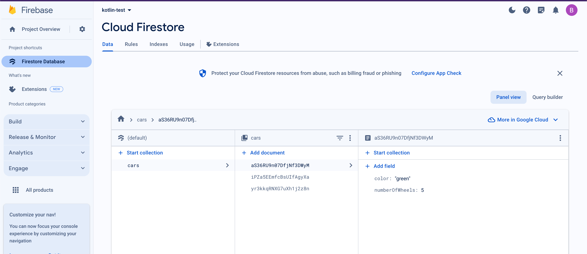
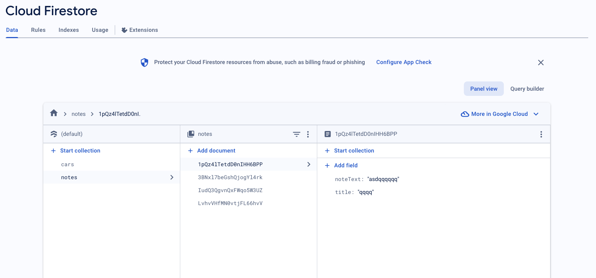
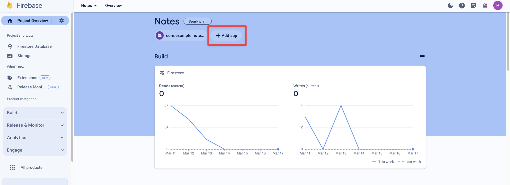

# Firebase Cloud Firestore


## Overview

- [https://www.youtube.com/@Wirtual](https://www.youtube.com/@Wirtual)
- Gå skemaet igennem for resten af semestret
- Snakke om repositories/arkitektur
- Create an app that uses firestore to save some entities (notes, videos, recipes, whatever)


## Create your Firestore in Firebase

go to [https://console.firebase.google.com/?pli=1](https://console.firebase.google.com/?pli=1) -> add project, give it a name -> Add analytics if necessary -> click create


Go into your Firestore and under `Get started by adding Firebase to your app` click on Android. Follow the guide. 


Now create a Database in your Firestore. Go to your firebase project -> click Cloud Firestore -> click Create database. Select `Start in test mode`

**🚨OBS!!!!!🚨**: The default security rules for test mode allow anyone with your database reference to view, edit and delete all data in your database for the  next 30 days **🚨OBS!!!!!🚨**

Now in your `build.gradle.kts` (Module App) add the following line

```
implementation("com.google.firebase:firebase-firestore")
```


## Secure your data

```json
// Allow read/write access on all documents to any user signed in to the application
service cloud.firestore {
  match /databases/{database}/documents {
    match /{document=**} {
      allow read, write: if request.auth != null;
    }
  }
}
```


## Create a Collection in Cloud Firestore

Go to your Cloud Firestore database



Click `Start collection` -> Give it a name -> Now create a document:

Give it an Auto-id and create the relevant fields and values for your first document


## Setting up Firestore

First we need to import the right libraries in the file you will be using

```kotlin
import com.google.firebase.Firebase
import com.google.firebase.firestore.firestore
```


Then you need to create a new instance of a Firestore database

```kotlin
val db = Firebase.firestore
```


## Saving data

We are now ready to use kotlin to save data in our database


### Creating a data class

To hold data we will be using a specific kind of class called a data class. A `data class` is a special class type primarily intended to hold data. The most important feature for us is the serialisation method. Serialization refers to the process of converting an object into a  format that can be stored or transmitted (like JSON, binary, etc.)

Let's create a `Car` data class that matches the fields in the Firestore database:

```kotlin
import com.google.firebase.firestore.DocumentId

data class Car(
    val color: String = "", // Make properties public
    val numberOfWheels: Int = 0 // Provide default values
  	@DocumentId var documentId: String? = null
) {}
```

The important is the `documentId` annotation! It ensures that the documentId from Firestore is put into the object when fetching and creating! That is because Firestore creates the id not us! At least by default


### Saving an object into Firestore

We now have all we need. Create a new object and add it to the database using the following code and the `.add` function

```kotlin
// Create a new user with a first and last name. Here Firestore will create a DocumentId but we dont need to add it when creating an object
val greenCar = Car("green", 5);

// Add a new document with a generated ID
db.collection("cars")
    .add(greenCar)
    .addOnSuccessListener { documentReference ->
        Log.d(TAG, "DocumentSnapshot added with ID: ${documentReference}")
    }
    .addOnFailureListener { e ->
        Log.w(TAG, "Error adding document", e)
    }
```


## Getting data from Firestore

To get data from Firestore we use the `.get` function

```kotlin
db.collection("cars")
  .get()
  .addOnSuccessListener { result ->
      for (document in result) {
          val car = document.toObject(Car::class.java)
          Log.d(TAG, "${document.id} => ${car}")
          Log.d(TAG, "${document.id} => ${car.color}")
      }
  }
  .addOnFailureListener { exception ->
      Log.w(TAG, "Error getting documents.", exception)
  }
```

Here we get the `result` from the database and then convert the result into an object we can work with in Kotlin using the `toObject` method: 

```kotlin
val car = document.toObject(Car::class.java);
Log.d(TAG, car.color)
```


 ### Query specific data

You can query specific data like this:

```kotlin
db.collection("cities")
  .whereEqualTo("capital", true)
  .get()
  .addOnSuccessListener { documents ->
      for (document in documents) {
          Log.d(TAG, "${document.id} => ${document.data}")
      }
  }
  .addOnFailureListener { exception ->
      Log.w(TAG, "Error getting documents: ", exception)
  }
```


It is also possible to delete and edit


## Exercise

Der er to slags opgaver idag. Den første er fokuseret på at i skal have forbindelse til Firestore og lave nogle simple ting med det. 

Den anden del fokuserer på hvordan man ville bruge Firestore i et mere "professionelt" setup


### Firestor App

Create an app that can add, get, delete and update some entities that are saved in a Firestore database. The UI does not really matter, and try not to focus too much on architecture or hoisting state and all that. 


Focus on the syntax of getting Firestore to work!


### Professional notes app

Jeg har lavet et lidt mere professionelt repo hvor der er taget et aktivt valg ift arkitekturen af applikationen. I skal finde ud af hvordan appen virker og hvordan arkitekturen fungerer. Der er ting vi ikke har snakket om endnu i applikationen, men se om i enten kan ignorere det. Ellers må i sætte jeg nok ind i det til at i kan arbejde med det.

Projektet kan findes her: [https://github.com/behu-kea/note-app](https://github.com/behu-kea/note-app)

For at få det til at virke, skal i gøre det følgende:

1. Tilføje en notes Collection i din Firestore database! 




2. Tilføje det nye projekt, så projektet kan tilgå jeres database. Her skal i skrive jeres package navn og så hente `google-services.json` filen ned og overskrive den der allerede ligger i projektet





#### Bug fix 1

Der er en bug i programmet, men hvor den er og hvordan man fikser den skal i finde ud af


#### Bug fix 2

Der er en ting med navigeringen der ikke er optimal, men hvad? Det skal i finde ud af og fikse


#### FEATURE 1

Søgning i noter. Når man søger efter en note, skal kun de relevante noter vises!


#### Feature 2

Man skal kunne slette en note på en eller anden måde


#### Feature 3

I skal lave en side hvor man kan skrive id'et på en note og se notens titel og tekst


