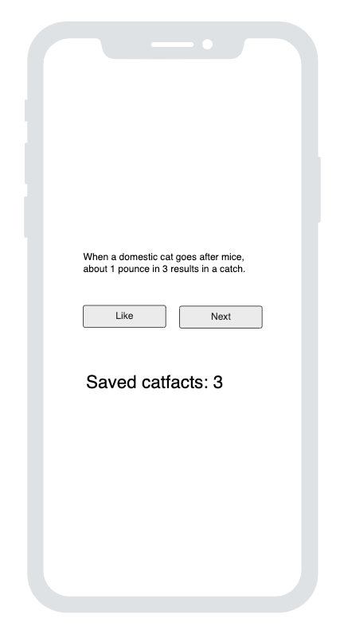
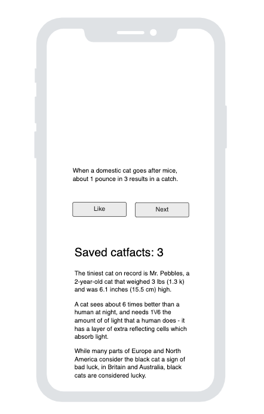
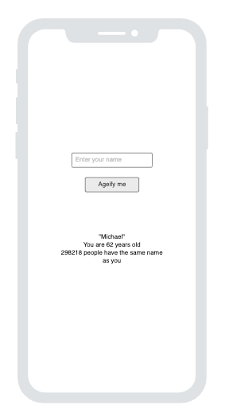

# Concurrency & retrofit in android development

Reference: https://github.com/nicklasdean/catfacts-app

**Important**

- Insert the following into your AndroidManifest.xml
  - Found in the manifests folder

```xml
<uses-permission android:name="android.permission.INTERNET" />
```

- Insert before the <application tag

```xml
// Like this

<?xml version="1.0" encoding="utf-8"?>
<manifest xmlns:android="http://schemas.android.com/apk/res/android"
    xmlns:tools="http://schemas.android.com/tools">
    <uses-permission android:name="android.permission.INTERNET" />

    <application
        android:allowBackup="true"
        android:dataExtractionRules="@xml/data_extraction_rules"                             
...
```


### Execise A.1

Add functionality to the above application such that:

- A user is initially greeted with a welcome screen.
- When the user presses the button - they are navigated to the screen that fetches the catfact.


### Exercise A.2

Add functionality to the above application such that:

- Users can save catfacts that they like 
  - The catfact are saved to an arraylist in the ViewModel. The list represents an 'in-memory' database
- When a user 'likes' a catfact, a counter on the same screen is updated. Such as below:



### Exercise A.3

Add functionality to the application such that

- The list of saved CatFacts are displayed on screen



### Exercise B

Build an application that uses [agify.io](https://agify.io/documentation) to determine the age of a user.

Note that to use parameter queries in a GET request - you can build an API interface like below.

- The parameter in the example is decided by the argument provided to the getAge function.   

```kotlin
interface AgifyAPI {
    @GET("/search")
    fun getAge(
        @Query("name") name: String
    ): Call<DTO>
}
```

