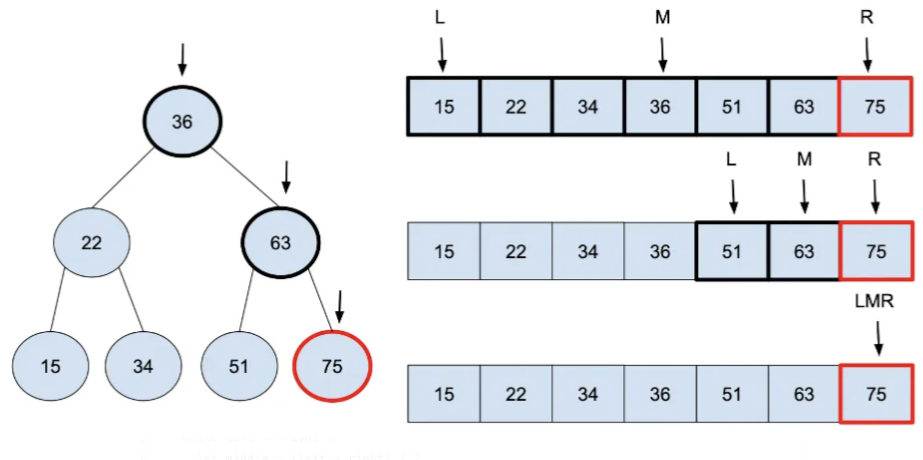

# Linear Search

**Preface: **These exercises are solved easily by large language models such as ChatGPT. It is highly advised **against usage** of LLM's for the purpose of **generating code** to solve these exercises and would count as **fraud**. It would furthermore defeat the purpose as the following exercises are made to sharpen logical thinking & shape algorithmic understanding.


### First repeating element

Given a list of integers arr[] The task is to find the index of first repeating element in it i.e. the element that occurs more than once

In this exercise you should use a index-based linear data structure such as an array.

**Example:**

```kotlin
val input = arrayOf(10,5,4,6,3,5,3,2);
//Output: 5
//Explaination: 5 is the first repeating element
```


### TwoSum problem

Given an array of integers `nums` and an integer `target`, return *indices of the two numbers such that they add up to `target`*.

You may assume that each input would have ***exactly\* one solution**, and you may not use the *same* element twice.

You can return the answer in any order.

**Example 1:**

```
Input: nums = [2,7,11,15], target = 9
Output: [0,1]
Explanation: Because nums[0] + nums[1] == 9, we return [0, 1].
```

**Example 2:**

```
Input: nums = [3,2,4], target = 6
Output: [1,2]
```

**Example 3:**

```
Input: nums = [3,3], target = 6
Output: [0,1]
```


<!--

Two sum quicker. We save the number as a key in an object. 

https://dev.to/shavonharrisdev/a-more-straightforward-guide-to-solving-two-sum-2gbi

-->


### Minimum distance

Given an array of integers, find the minimum distance between two repeating elements. In other words, find the minimum difference between the indices of any two elements that are equal to each other. If there are no repeating elements in the array, return -1.

**Example 1**

```
Input: [3, 6, 8, 2, 4, 3, 9, 1, 7, 5, 4] Output: 1

Explanation: In this array, the repeating elements are 3 and 4, and their minimum distance is |5 - 10| = 5.
```

**Example 2**

```
Input: [2, 7, 1, 4, 9, 5] Output: -1

Explanation: There are no repeating elements in this array, so the output is -1.

```


### Advanced (Optional)

You are an IT company's manager. Based on their performance over the last N working days, you must rate your employee. You are given an array of N integers called workload, where workload[i] represents the number of hours an employee worked on an ith day. The employee must be evaluated using the following criteria:

- Rating = the maximum number of consecutive working days when the employee has worked more than 6 hours.

You are given an integer *N* where *N* represents the number of working days. You are given an integer array *workload* where *workload[i]* represents the number of hours an employee worked on an ith day.

**Task**

Determine the employee rating.

**Example**

*Assumptions*

- *N =* 12
- *workload* = [2, 3, 7, 8, 7, 6, 3, 8, 12, 11, 12, 10]

*Approach*

*Workload* with consecutive hours > 6 = [2, 3, **7, 8, 7**, 6, 3, **8, 12, 11, 12, 10**] => Longest Interval = [8,12,11,12,10]

Therefore return *5*.


## Binary Search

Implement **Binary Search**

Visualisation: https://youtu.be/E6IOrZUpvSE?si=QV0w8CYACc3yG820

''

- You can assume that the array is non-empty.
- You can assume that the array is already sorted.