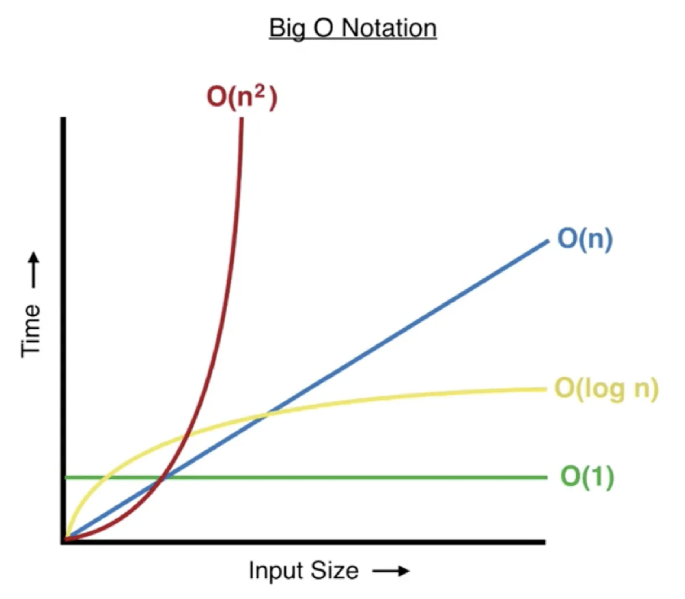

# Exercises: Code comprehension & Big-O

**Preface: **These exercises are solved easily by large language models such as ChatGPT. It is highly advised **against usage** of LLM's for the purpose of **generating code** to solve these exercises and would count as **fraud**. It would furthermore defeat the purpose as the following exercises are made to sharpen logical thinking & shape algorithmic understanding.


Read the following code bits and determine their run-time:



**A)**

```Kotlin

fun detectAnomalies(sensorData: List<Double>): List<Int> {
    val anomalies = mutableListOf<Int>()
    for (i in sensorData) {
        if (sensorData[i] > 10.0) {
            anomalies.add(i)
        }
    }
    return anomalies
}
```

**B)**

```kotlin
fun main() {
    val phoneNumberMap = mapOf(
        "John" to "555-1234",
        "Alice" to "555-5678",
        "Bob" to "555-9012"
    )

    val alicePhoneNumber = phoneNumberMap["Alice"]
    println("Alice's phone number: $alicePhoneNumber")
}
```

**C)**

```Kotlin
fun linearSearch(arr: IntArray, target: Int): Int {
    for (i in arr.indices) {
        if (arr[i] == target) {
            return i
        }
    }
    return -1
}
```

**D)**

```kotlin
fun subtotals(array: IntArray): List<Int> {
    val subtotalArray = mutableListOf<Int>()
    for (i in array.indices) {
        var subtotal = 0
        for (j in 0..i) {
            subtotal += array[j]
        }
        subtotalArray.add(subtotal)
    }
    return subtotalArray
}
```

**E)**

```Kotlin
data class Order(
    val orderId: String,
    val items: List<Item>
)

data class Item(
    val itemId: String,
    val price: Double
)

fun findHighValueOrders(orders: List<Order>, threshold: Double): List<String> {
    val highValueOrderIds = mutableListOf<String>()

    for (order in orders) {
        var totalOrderValue = 0.0
        for (item in order.items) {
            totalOrderValue += item.price
        }
        if (totalOrderValue > threshold) {
            highValueOrderIds.add(order.orderId)
        }
    }

    return highValueOrderIds
}
```

**F)**

```kotlin
fun identifySpamEmails(emails: List<String>, spamKeywords: Set<String>): List<String> {
    val spamEmails = mutableListOf<String>()

    for (email in emails) {
        for (keyword in spamKeywords) {
            if (email.contains(keyword, ignoreCase = true)) {
                spamEmails.add(email)
                break
            }
        }
    }

    return spamEmails
}
```


### Exercises: Sorting algorithms

You are allowed to use the linked videos or visualisations - but **not** copy code.

- If you are stuck - look at pseudocode


Implement the [selection sort](https://www.youtube.com/watch?v=3hH8kTHFw2A) algorithm with the following elements:

```kotlin
val unsortedNumbers = listOf(29, 15, 8, 47, 63, 22, 56, 31, 74, 19, 33, 41, 52, 60, 10, 88, 92, 38, 45, 17)
```

- Understand the algorithm with pen and paper
- [Visualisation](https://www.youtube.com/watch?v=Iccmrk2ZWoc)


Implement the [insertion sort](https://www.youtube.com/watch?v=O0VbBkUvriI) algorithm with the following elements:

```kotlin
val unsortedStrings = listOf(
    "banana", "apple", "orange", "grape", "kiwi", 
    "pineapple", "watermelon", "strawberry", "blueberry", "raspberry", 
    "peach", "pear", "mango", "lemon", "lime", 
    "cherry", "plum", "apricot", "blackberry", "papaya"
)
```

- Understand the algorithm with pen and paper

- [Visualiasation](https://youtu.be/JU767SDMDvA?si=3pT2PlxJW48F3wll)


**Advanced (Optional)**

You are organizing a movie night with your friends, and you've collected a list of movies that everyone wants to watch. However, each person has ranked the movies in their own order of preference. Your task is to create a sorted list of movies that maximizes overall enjoyment for the group.

Here's the challenge:

You're given a list of movie rankings for each person in the group. Each ranking is a list of movie titles, with the first movie being the most preferred and the last movie being the least preferred. Your goal is to create a final list of movies that optimizes the overall satisfaction of the group. This means that the most preferred movies should be at the beginning of the list, and the least preferred movies should be at the end. You can only rearrange the movies within each person's ranking. You cannot change the order of people's rankings or remove/add movies. Write a function that takes in the list of rankings and returns the sorted list of movies.

```kotlin
  // Example input
  val rankings = listOf(
      listOf("The Shawshank Redemption", "Inception", "Pulp Fiction"),
      listOf("Inception", "The Shawshank Redemption", "Pulp Fiction"),
      listOf("Pulp Fiction", "The Shawshank Redemption", "Inception")
  )

  // Expected output
  val sortedMovies = sortMovies(rankings)
  println(sortedMovies)
```

In this example, "The Shawshank Redemption" is the most preferred movie overall, so it should be at the beginning of the sorted list. "Inception" is the second most preferred movie overall, followed by "Pulp Fiction". The final list maximizes the overall enjoyment for the group.

Your task is to implement the function that achieves this sorting efficiently and accurately.